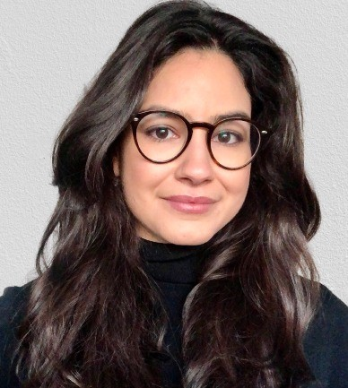

{ width=30% }

I am a demographer researching issues related to health and mortality, specifically the methodological challenges and gender gaps in mortality, as well as in the longevity of specific subgroups and selection in mortality studies. In 2018, I joined as a research scientist the [**Health and Longevity research group (HELO)**](https://www.oeaw.ac.at/vid/research/research-groups/health-longevity), headed by [**Dr. Marc Luy**](https://www.delag.eu/), at the [**Vienna Institute of Demography at the Austrian Academy of Sciences**](https://www.oeaw.ac.at/vid), part of the [**Wittgenstein Centre for Demography and Global Human Capital (IIASA,OeAW,University of Vienna)**](http://www.wittgensteincentre.org/en/index.html). 
In the framework of the ERC project **Levels and Trends of Health Expectancy: Understanding its Measurement and Estimation Sensitivity**, I mainly perform sensitivity analysis of healthy life expectancy indicators regarding different measurement and estimation methods.

I am also one of the Editors of the [**Vienna Yearbook of Population Research (VYPR)**](https://www.oeaw.ac.at/vid/publications/serial-publications/vienna-yearbook-of-population-research). Feel free to reach out regarding submissions! 
I hold a bachelor degree in Social Sciences with a minor in Philosophy from the [**Federal University of Minas Gerais, Faculty of Philosophy and Human Sciences (FAFICH/UFMG)**](https://www.fafich.ufmg.br/), and a Master’s and Doctorate degree in Demography from the [**Centre of Development and Regional Planning at the Faculty of Economic Sciences (CEDEPLAR,FACE/UFMG)**](https://www.cedeplar.ufmg.br/)
