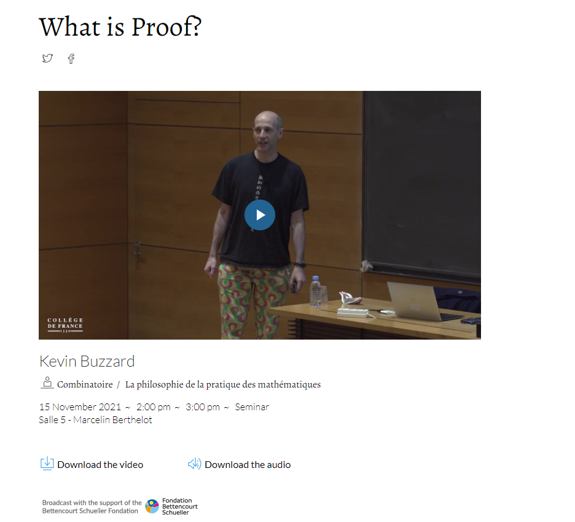

](einstein.jpg)

Albert Einstein is one of the most influential scientists in the 20th Century. He inspired me a lot with his unusual quirks and interesting views and quotes on mathematics and reality - which spoke highly to me, a person who always thought was really bad at math. "Do not worry too much about your difficulties in mathematics, I can assure you that mine are still greater" is one of these quotes that can be interpreted in many ways, but for me it meant that I could, in fact, pursue my interest in this challenging field. I also think that they way mathematics is taught is, in many ways, disconnected from its inherent creativity and abstract thinking. *Eugenia Cheng* mentions in her book [**The Art of Logic in an Illogical World**](https://www.basicbooks.com/titles/eugenia-cheng/the-art-of-logic-in-an-illogical-world/9781541672482/) how we have a misconception around mathematics that stems from thinking it as a set of rules you follow to get a right answer, which is usually a number. But that *real* mathematics - or the one you can do when in research - is a "world to explore, discover and understand: the logical world". Content is important, of course, and *Ian Stewart* in his Foreword of the 1990 Edition of [**How to Solve it**](https://www.amazon.de/-/en/gp/product/0140124993/ref=dbs_a_def_rwt_bibl_vppi_i2), by *George Pólya*, mentions that the key to avoid seeing mathematics as only a set of rules is to grasp "problem-solving as a practical tool, part of the mathematician's mental equipment, but not as an end in itself". This view endorses some of methods by George Pólya where one can guess new results from known results: specialization, generalization and analogy, which are part of "plausible reasoning", like the Figure below. 

](poly.png)

*George Pólya* also has a set of rules of thought and strategies to think like a mathematician in four steps, as explained below: 

](poly2.png)

I will update here posts about some views, readings, and stuff I am working on leisurely. For now, I will just go home with another quote by my friend Albert: "Pure mathematics is, in its way, the poetry of logical ideas".

                                                 - VDL

# Kevin Buzzard on Proof

In this talk at [**Collège de France**](https://www.college-de-france.fr/site/timothy-gowers/seminar-2021-11-15-14h00.htm) on November 15, 2021, [**Professor and Mathematician Kevin Buzzard**](https://www.imperial.ac.uk/people/k.buzzard) prompts the topic of "what is proof?", within the field of Philosophy of Mathematical Practice.  

He starts provocatively by discussing contradictory results; or what happens when there are papers in respected journals that contradict each other? Arguably, there is a formal definition of mathematical proofs in such a way that every argument is either valid or invalid. So how could there be contradictions? 

One topic he mentions that struck me is connected to the recent rational solutions found to a famously 40-year long difficult mathematical problem [**Cursed Curve**](https://www.quantamagazine.org/mathematicians-crack-the-cursed-curve-20171207/). Apparently, it is the equation:

$$y^4 + 5x^4 − 6x^2y^2 + 6x^3z + 26x^2yz + 10xy^2z − 10y^3z − 32x^2z^2\\ − 40xyz^2 + 24y^2z^2 + 32xz^3 − 16yz^3 = 0$$

(Now you know how to properly curse someone in mathematical language). The issue is that the proof uses a closed-source computer system (magma). How can one call proof something that is closed and difficult to verify by the community at large? There are other problems that he mentions to take stock of the issue of proof itself as a scientific practice and its validity, especifically in a field where this is so essential such as mathematics. Another interesting topic he raises are the differences between human proof and computer proof.

In my view, I started to think of the role of computational power and programs in how we develop knowledge in other fields. In demography, for instance, increased computer power has definitely enabled to advance so many topics and opened other research avenues. I often feel that we are more and more becoming data scientists and programming has become more essential (I think of me as a graduate student without previous excel use and now I am here writing on the webpage I created using Rstudio and Githhub) for our everyday tasks. As much as I value and consider this an important advancement, I cannot stop but wonder how will computer power shape the way we do, think and interpret research. In an area where we don´t have "cursed curves", but "live curves", how can we find a balance where knowledge is traceable? Who is held accountable for producing knowledge that often guides policy and informs important human phenomena?

                                                 - VDL
