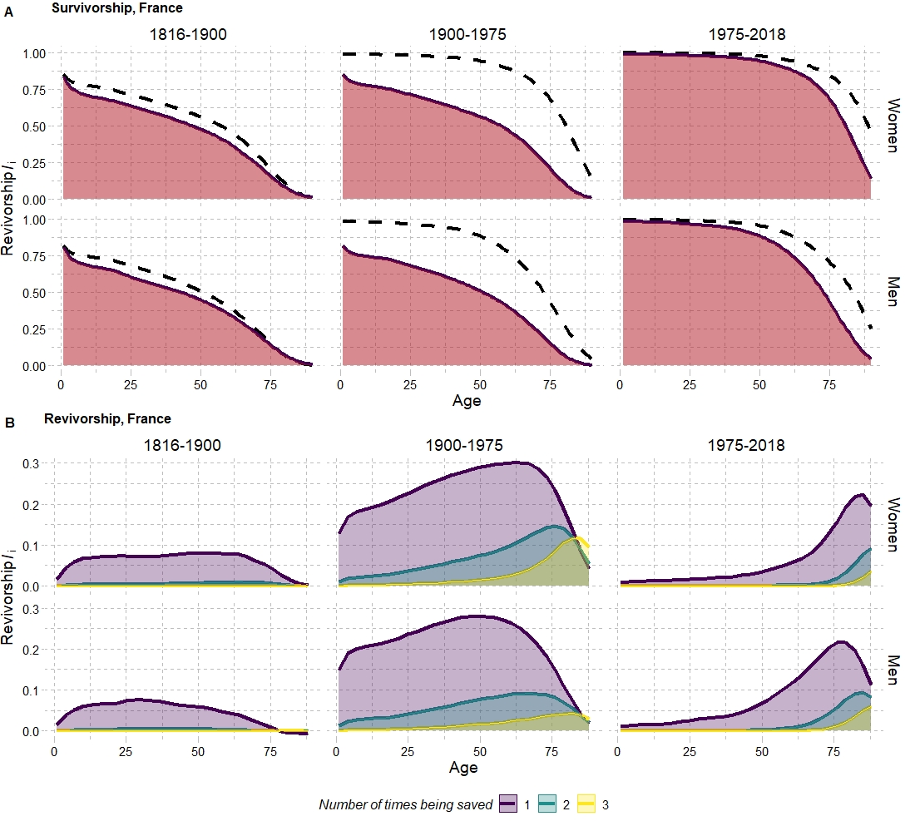

{width=30}

I am currently exploring the revivorship function as part of demographic models of lifesaving as developed by @Vaupel1986, @Vaupel1987b and recently extended and discussed by @Schmertmann2020. The concept of force of mortality $\mu_x$ is coupled with the notion of lifesaving $\lambda_x$. This construct allows for assessing the formal relationships between survivorship ($l_x$), density distribution of deaths ($d_x$) and life expectancy ($e_x$) between two different regimes in a dynamic way, instead of focusing on comparing different mortality trajectories as proposed by @Pollard1982 or on the density distribution of deaths ($d_x$), as in @Bergeron-Boucher2017a or @Basellini2019a. In a context of mortality improvement, the new force of mortality $\mu_x^*$ can be seen as a decomposition of the old mortality regime $\mu_x$ plus a force of lifesaving $\lambda_x$. At each age, a proportion $\delta$ of individuals who would have died are now resuscitated and given another chance or another ticket to life  [@Wachter2005]. The process can be mathematically described by a factorial reminiscent of the Poisson distribution, resulting in a revivorship function that estimates the probability that an individual will be given $n$ chances (will be resuscitated) $i$ times by age $x$. It is also possible to decompose life expectancy differentials into gains in $\tau_i$ life years at each averted death state. This approach can provide valuable insights into how the lifesaving process unfolds, including its effect on life expectancy and on tempo effects.

# Rationale

The demographic model of lifesaving developed by [@Vaupel1987b] combines the concept of force of mortality $\mu_x$ with the notion of lifesaving $\lambda_x$, wherein mortality improvement can be conceived as both a reduction on the force of mortality $\mu_x$ or as an increase in the force of lifesaving $\lambda_x$. Hence, progress in mortality can be reviewed through the link between the old and new mortality regimes:

\begin{equation}  
\mu^*_x = \mu_x-\lambda_x
\end{equation}

Where $\mu^*_x$ is the new mortality regime and $\mu_x$ the old one. This lifesaving force $\lambda_x$ can lead to many lives being saved once, more than once or none at all. The effect of saving lives on life expectancy depends on both the number of deaths at various ages and on the number of additional years of life a resuscitated person might have. The number of times deaths were averted in order to achieve a given mortality regime can be described through the "revivorship" function, defined as:

\begin{equation}  
l^*_x= l_x+l_ix+l_2x+...
\end{equation}

And that the chances of repeated resuscitation are:

\begin{equation}  
l_ix= l_x\Lambda{x^i/i!}, i= 0,1,2,...
\end{equation}

Where:
\begin{equation}  
\Lambda(x)= \int_{0}^{x}\lambda(t) dt 
\end{equation}

With:
\begin{equation}  
\Lambda(x)= \ln(l^*(x)/l(x))
\end{equation}

Further, it is possible to establish the relationship between survival under the new and old regimes  through:

\begin{equation}  
l^*_{(x)}= l_{(x)}+l_x\Lambda_{(x)}+[l_{(x)}\Lambda_{(x)}^2]/2+...+[l_{(x)}\Lambda_{(x)}^i]/i!
\end{equation}

From which we can decompose the value of life expectancy into $\tau_i$: 
\begin{equation}  
\tau_{i}= \int_{0}^{\omega}l_i(x) dx =
\int_{0}^{\omega}l_{(x)}\Lambda_{(x)}^i dx/i!. 
\end{equation}

With 
\begin{equation}  
\Lambda(x)= \ln(l^*(x)/l(x))
\end{equation}

These relationships can be very interesting to explore in order to evaluate how the survivorship function changes in the process of lifesaving and how one could interpret mortality transition in different ways. Check out my codes in development [**here**](https://github.com/vdilego/WhoWasSavedMore_DR). Suggestions and criticisms welcome!

